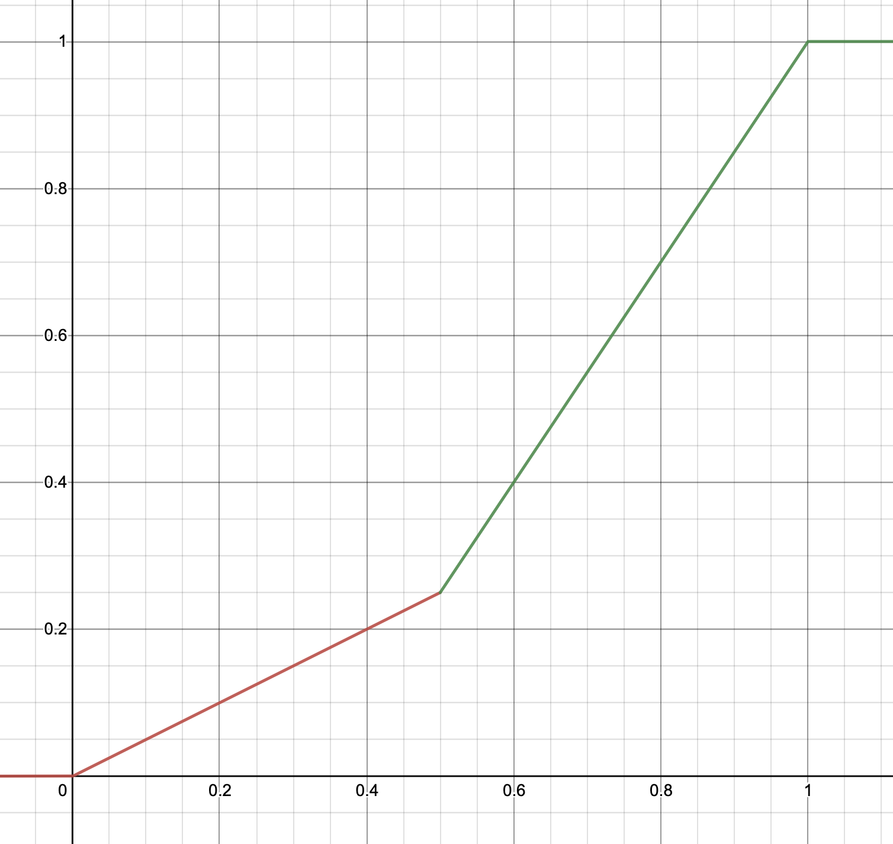

# Vesting Plans

As the Wynd project seeks to encourage sustainability and long-term committment, we will be using vesting plans
on almost all the genesis tokens (except for a small amount of liquidity immediately available by the Foundation
to bootstrap the AMM Pools). This design is based on the
[standard Cosmos SDK vesting account](https://docs.cosmos.network/master/modules/auth/05_vesting.html),
but we will be implementing this as part of a cw20 contract, as the above only works with native tokens.

Tokens that are vesting will only be able to be used with the DAO staking contract to get voting rights.
All other tokens in the account (including liquid tokens sent to the account later) will be able to be used
normally.

While researching this design, we discovered that we are not the only project to provide vesting on the
airdrops, and Asset Mantle is using a similar approach:

## Curves Used

The basic approach would be a linear vesting curve. This has a start date and an end date and an initial amount.
Up until the start date, the entire amount is vesting; after the end date, zero tokens are vesting; between those
periods, the number decreases linearly, so after 25% of the time between start and end, 25% of the tokens have vested
(are unlocked).

{: height="640" }

We believe the first 6 months are going to be pivotal for the protocol and prove the value of holding $WYND for the
longer term, so we would like to vest a bit slower in the initial region. For that purpose, we plan to use
"piecewise linear" vesting curve, using the same math as [Aave interest rates](https://docs.aave.com/risk/liquidity-risk/borrow-interest-rate#interest-rate-model).

Basically the idea is we target 25% vested after 6 months. That means it increases linearly (a bit slower) for the first
6 months, and then a faster linear vesting for the next 6 months. After 25% of the time, only 12.5% will be vested, but
after 75% of the time, 62.5% will have been vested.

{: height="640" }

## Vesting periods

All airdrop tokens will be subject to the same vesting rate, this is the piece wise linear curve above...
a 1 year vesting period, with 25% vesting in the first 6 months, and the remaining 75% vesting in the second 6 months.

For the core team, we will start with a 6 month lockup, where no tokens are liquid at all, and then provide a linear
vesting between months 6 and 18.

For the foundation, 25% of the tokens will be initially liquid and 75% will be subject to vesting periods. These will
be under a 3 year linear vesting period, to ensure the foundation spread the grant funding over a longer periods.
Ideally the foundation holds the tokens much longer than strictly necessary.